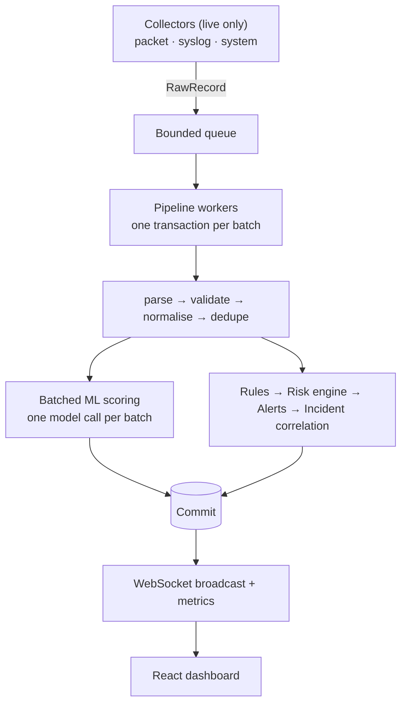

<div align="center">

# 🛡️ Mini SOC

**Real-time network security monitoring and threat detection, in one self-hosted stack.**

Collect live network and security events → normalise → detect with rules **and** machine learning → score risk → raise alerts → correlate into incidents → investigate on a live dashboard.


</div>

> [!WARNING]
> **For authorized networks only.** Monitor and test only systems you own or have explicit permission to observe.

---

## Table of contents

- [Why Mini SOC](#why-mini-soc)
- [Features](#features)
- [Architecture](#architecture)
- [Quick start](#quick-start)
- [Configuration](#configuration)
- [Repository layout](#repository-layout)
- [Testing and verification](#testing-and-verification)
- [Real-time data only](#real-time-data-only)
- [Documentation](#documentation)
- [Project status](#project-status)
- [License](#license)

## Why Mini SOC

Mini SOC runs the full **OBSERVE → COLLECT → NORMALIZE → ANALYZE → DETECT → SCORE → ALERT → INVESTIGATE → RESPOND** loop on a single machine. It is built for labs, small networks, learning and research, with no external SIEM required.

## Features

| Area | What you get |
|------|--------------|
| **Collection** | Live packet capture (scapy/Npcap, metadata only), UDP syslog/firewall receiver (RFC 3164/5424), host telemetry (psutil) |
| **Processing** | Parser → validator → normaliser → deduplicator → behavioural feature store (14 per-entity features) |
| **Detection** | 7 rule types from editable YAML packs (port scan, brute force, connection flood, repeated failures, DNS anomaly, volume anomaly, suspicious protocol) plus Isolation Forest anomaly detection |
| **Risk scoring** | 0–100 score from rule/anomaly contributions, asset importance and behaviour boosts, configurable severity bands |
| **Alerts & incidents** | Automatic alerts with dedupe, full lifecycle (`NEW → ACKNOWLEDGED → INVESTIGATING → RESOLVED`), correlation into incidents, notes and assignment |
| **API** | FastAPI REST (`/api/v1`), WebSocket channels (`/ws/live`, `/ws/alerts`, `/ws/network`), OpenAPI docs |
| **Security** | JWT + refresh tokens, bcrypt, RBAC (`ADMIN` / `ANALYST` / `VIEWER`), rate limiting, audit log, secure headers, trusted hosts |
| **Dashboard** | React 18 + Vite with 9 pages: Overview, Live Monitor, Alerts, Incidents, Network, Threats, Analytics, Investigation, Reports |
| **Storage** | SQLite (WAL, single-writer pipeline); PostgreSQL via one environment variable |
| **Operations** | Metrics and latency instrumentation, health/ready probes, retention purge, Windows scripts, Docker Compose stack |

## Architecture



Deep dives: [Architecture](docs/architecture/README.md) · [API](docs/api/README.md) · [Database](docs/database/README.md) · [ML](docs/ml/README.md) · [Deployment](docs/deployment/README.md)

## Quick start

### Option 1: Windows scripts

```bat
scripts\setup.bat          :: venv, Python deps, .env, npm install
:: edit .env: set MINI_SOC_ADMIN_PASSWORD (and MINI_SOC_JWT_SECRET for production)
scripts\start_all.bat      :: backend :8000 + dashboard :5173
```

Create the first administrator, log in, and the Live Monitor starts filling up.

> [!NOTE]
> Packet capture needs [Npcap](https://npcap.com/) installed and a network interface you are authorized to monitor.

### Option 2: Docker

```bash
cp .env.example .env       # set MINI_SOC_JWT_SECRET and MINI_SOC_ADMIN_PASSWORD
docker compose up --build  # dashboard :8080, API :8000
```

### Option 3: Manual

```bash
python -m venv .venv

# Windows
.venv/Scripts/python.exe -m pip install -r backend/requirements.txt -r backend/requirements-dev.txt -r ml/requirements.txt
cd backend && ../.venv/Scripts/python.exe -m uvicorn app.main:app --host 127.0.0.1 --port 8000

# Linux/macOS: use .venv/bin/python instead of .venv/Scripts/python.exe
```

```bash
# in a second terminal
cd frontend && npm install && npm run dev
```

Interactive API docs are served by FastAPI at `http://127.0.0.1:8000/docs`.

## Configuration

All settings are environment variables, documented in [`.env.example`](.env.example).

| Variable | Purpose |
|----------|---------|
| `MINI_SOC_ADMIN_PASSWORD` | Password for the first administrator (required) |
| `MINI_SOC_JWT_SECRET` | Token signing secret (**set explicitly in production**) |
| `MINI_SOC_SIMULATOR_ENABLED` | Enables the lab simulator. Leave unset/`false` outside an isolated lab |

Detection rules live in [`detection-rules/`](detection-rules/README.md) as YAML packs and are hot-reloaded. Collector sources and the BPF filter can be configured or disabled per deployment.

## Repository layout

```text
mini-soc/
├── backend/            FastAPI app, pipeline, detection, storage (236 tests)
├── frontend/           React dashboard (14 tests)
├── ml/                 Training pipeline + versioned model artifacts
├── detection-rules/    YAML rule packs
├── collectors/         Layout anchor, see collectors/README.md
├── database/           Layout anchor, see database/README.md
├── tests/              Layout anchor, see tests/README.md
├── scripts/            Setup / run / test / benchmark / validation (Windows .bat + Python)
├── docs/               architecture · api · database · ml · deployment
├── logs/               Runtime logs + benchmark/validation/training reports
├── data/               Runtime database and secrets (created on first start)
└── .env.example · docker-compose.yml · LICENSE · README.md
```

## Testing and verification

Reproduce the results below with:

```bat
scripts\run_tests.bat
scripts\validate_lab.bat
scripts\benchmark.bat 4000
```

Measured on the development machine (full reports in [`logs/`](logs/)):

| Check | Result |
|-------|--------|
| Backend suite | **236 passed**: pipeline, detection, alerts, API, security, ML |
| Dashboard suite | **14 passed**, production build OK |
| Lab validation | **5/5 scenarios passed** (port scan, brute force, DNS tunnelling, volume anomaly detected). 0 rule false positives and 0 ML alerts on 240 benign records. See `logs/validation-report.json` |
| Benchmark | 4,000 events with ML enabled: **~210 events/s** sustained; detection latency mean 0.21 ms / p95 0.62 ms; processing mean 9.4 ms; database 0.07 ms; 0 rejects/drops/errors; ~199–216 MB RSS. See `logs/benchmark-report.json` |
| Baseline model | Precision 0.943 · Recall 1.000 · F1 0.971 · FPR 3.05% · ROC AUC 0.9996 (`baseline_isolation_forest:v2-20261003`, see `logs/training-report.json`) |

The security suite covers auth bypass, token expiry/revocation, rate limiting, non-leaking validation errors and header hardening.

## Real-time data only

Every figure the dashboard shows comes from traffic that was actually collected: packet capture, the syslog/firewall receiver, or host telemetry. Nothing is seeded, sampled or fabricated client-side.

The only generator in the codebase is the authorized-lab **simulator**. It is disabled unless `MINI_SOC_SIMULATOR_ENABLED=true` is set on an isolated lab host, and while it runs the dashboard shows a red **LAB DATA** badge so synthetic events can never be mistaken for production traffic.

## Documentation

| Topic | Link |
|-------|------|
| Architecture | [docs/architecture](docs/architecture/README.md) |
| REST & WebSocket API | [docs/api](docs/api/README.md) |
| Database & PostgreSQL | [docs/database](docs/database/README.md) |
| ML training & registry | [docs/ml](docs/ml/README.md) |
| Deployment & production checklist | [docs/deployment](docs/deployment/README.md) |
| Detection rule authoring | [detection-rules](detection-rules/README.md) |

## Project status

<details>
<summary><b>Feature checklist (all complete)</b></summary>

- [x] Connects to authorized network/security event sources (packet, syslog, system); sources and BPF filter configurable
- [x] Continuous collection with a bounded pipeline; back-pressure drops are counted (`stats.dropped`) rather than stalling
- [x] Common normalised schema with validator/normaliser (`test_processors.py`)
- [x] Reliable storage: SQLite WAL, one transaction per batch, per-record savepoints, atomic ID sequences; PostgreSQL supported
- [x] Rule-based detection: 7 rules from hot-reloaded YAML packs
- [x] ML anomaly detection: Isolation Forest from a versioned registry; every prediction stored
- [x] Risk scores with components, boosts and classification
- [x] Automatic alerts with dedupe and lifecycle
- [x] Related alerts correlated into incidents
- [x] Live dashboard updates over WebSocket
- [x] Analyst workflow: status, assignment, notes, investigation pages
- [x] Historical analytics: `/analytics`, `/threats`, `/dashboard/summary`, network stats, Reports page
- [x] Authentication and authorization: JWT/refresh, three-role RBAC, rate limits, audit log
- [x] Automated tests (236 backend + 14 dashboard)
- [x] Performance benchmarked (`scripts/benchmark_pipeline.py`)
- [x] Security testing performed, with a documented production checklist
- [x] Documentation complete

</details>

## License

Released under the [MIT License](LICENSE).
